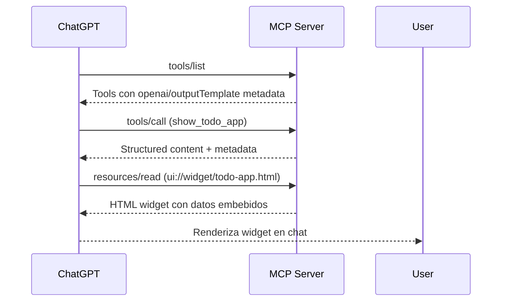

# OpenAI Apps SDK Integration Guide

## ✅ Setup Complete

El proyecto ahora usa el SDK oficial de MCP Python (`mcp[fastapi]`) siguiendo el patrón de OpenAI Apps SDK para integración con ChatGPT.

## Arquitectura

### MCP Server con Widgets UI

El servidor implementa:

1. **MCP Protocol Handlers**:
   - `list_tools()` - Expone 7 herramientas con metadata de OpenAI
   - `list_resources()` - Sirve recursos HTML de widgets
   - `read_resource()` - Genera HTML dinámico para widgets
   - `call_tool()` - Procesa llamadas con contenido estructurado

2. **OpenAI Apps SDK Metadata**:
   ```python
   {
       "openai/outputTemplate": "ui://widget/todo-app.html",  # URI del widget
       "openai/widgetAccessible": True,                        # Widget habilitado
       "openai/resultCanProduceWidget": True,                  # Puede producir widget
       "openai/toolInvocation/invoking": "Loading...",        # Mensaje en progreso
       "openai/toolInvocation/invoked": "Loaded"              # Mensaje completado
   }
   ```

3. **Transport**: Streamable HTTP (MCP spec 2025-03-26)
   - Endpoint: `POST /mcp`
   - Headers requeridos: `Content-Type: application/json`, `Accept: application/json, text/event-stream`
   - MIME type de widgets: `text/html+skybridge`

## Herramientas Disponibles

### Herramientas con UI Widgets

1. **show_todo_app**
   - Muestra la aplicación completa de todos con dashboard de estadísticas
   - Widget URI: `ui://widget/todo-app.html`
   - Genera HTML dinámicamente con todos actuales

2. **show_todo_stats**
   - Muestra visualización de estadísticas
   - Widget URI: `ui://widget/todo-stats.html`
   - Dashboard con métricas visuales

### Herramientas Estándar

3. **create_todo** - Crear nuevo todo con título, descripción y prioridad
4. **list_todos** - Listar todos con filtro opcional por estado
5. **update_todo** - Actualizar estado o título de un todo
6. **delete_todo** - Eliminar un todo por ID
7. **get_todo** - Obtener un todo específico por ID

## Cómo Funciona

### 1. Flujo de Widget



### 2. Formato de Respuesta de Tool

```json
{
  "content": [
    {
      "type": "text",
      "text": "Here are your todos!"
    }
  ],
  "structuredContent": {
    "todos": [...],
    "stats": {...}
  },
  "_meta": {
    "openai/toolInvocation/invoking": "Loading your todos",
    "openai/toolInvocation/invoked": "Todos loaded"
  }
}
```

### 3. Widget HTML

Los widgets se generan dinámicamente con:
- Estilos inline (sin CSS externo)
- Datos actuales del storage
- HTML completo y auto-contenido
- Diseño responsivo

## Iniciar el Servidor

```bash
# Instalar dependencias
uv sync

# Iniciar servidor MCP
uv run uvicorn src.todo_app.main:app --reload --port 8000

# O usar justfile
just dev
```

## Testing Local

### 1. Listar Tools

```bash
curl -X POST http://localhost:8000/mcp \
  -H "Content-Type: application/json" \
  -H "Accept: application/json, text/event-stream" \
  -d '{"jsonrpc": "2.0", "id": 1, "method": "tools/list", "params": {}}'
```

### 2. Llamar Tool

```bash
curl -X POST http://localhost:8000/mcp \
  -H "Content-Type: application/json" \
  -H "Accept: application/json, text/event-stream" \
  -d '{
    "jsonrpc": "2.0",
    "id": 2,
    "method": "tools/call",
    "params": {
      "name": "create_todo",
      "arguments": {
        "title": "Test todo",
        "priority": "high"
      }
    }
  }'
```

### 3. Leer Widget Resource

```bash
curl -X POST http://localhost:8000/mcp \
  -H "Content-Type: application/json" \
  -H "Accept: application/json, text/event-stream" \
  -d '{
    "jsonrpc": "2.0",
    "id": 3,
    "method": "resources/read",
    "params": {
      "uri": "ui://widget/todo-app.html"
    }
  }'
```

## Integración con OpenAI Apps SDK

### 1. Exponer con ngrok

```bash
# Terminal 1: Servidor
just dev

# Terminal 2: Tunnel
just tunnel  # o: ngrok http 8000
```

Copia la URL HTTPS de ngrok (ej: `https://abc123.ngrok-free.dev`)

### 2. Configurar en OpenAI Platform

1. Ve a https://platform.openai.com/apps
2. Crea o actualiza tu app
3. Configura el endpoint MCP:
   - URL: `https://YOUR-NGROK-URL/mcp`
   - Asegúrate que OpenAI envíe ambos headers Accept

### 3. Probar en ChatGPT

Una vez configurado, puedes usar comandos como:

- "Show me my todos" → Llama `show_todo_app`, renderiza widget UI
- "Create a todo for 'Buy groceries'" → Llama `create_todo`
- "What are my stats?" → Llama `show_todo_stats`, muestra dashboard
- "List my pending todos" → Llama `list_todos` con filtro
- "Mark todo X as completed" → Llama `update_todo`

## Diferencias vs FastMCP

| Aspecto | FastMCP (anterior) | Official MCP SDK (actual) |
|---------|-------------------|---------------------------|
| Paquete | `fastmcp>=2.13.0` | `mcp[fastapi]>=0.1.0` |
| API | Decoradores `@mcp.tool()` | Handlers explícitos |
| Transport | `http_app()` con configuración | `streamable_http_app()` |
| Metadata | Dict simple | Formato OpenAI Apps SDK |
| Widgets | Retorno directo | Resources MCP + metadata URI |
| Compatibilidad | Buena con MCP básico | 100% con OpenAI Apps SDK |

## Estructura de Archivos

```
src/todo_app/
├── main.py          # Servidor MCP principal (Starlette app)
├── mcp_server.py    # Implementación MCP con handlers
├── models.py        # Modelos Pydantic
├── storage.py       # Storage en memoria
└── ui_components.py # (deprecated - ahora en mcp_server.py)
```

## Troubleshooting

### Widget no se muestra en ChatGPT

1. Verifica que el tool tenga metadata `openai/outputTemplate`
2. Asegúrate que el resource esté registrado en `list_resources()`
3. Confirma que `read_resource()` retorna HTML válido con MIME `text/html+skybridge`

### Error "Not Acceptable"

- Verifica que envías ambos headers: `Accept: application/json, text/event-stream`
- Endpoint correcto: `POST /mcp` (no `/mcp/`)

### Endpoint 404

- El servidor usa `streamable_http_app()` que crea ruta en `/mcp`
- No montes en sub-ruta, sirve directamente la app MCP

## Referencias

- [OpenAI Apps SDK Examples](https://github.com/openai/openai-apps-sdk-examples)
- [Official MCP Python SDK](https://github.com/modelcontextprotocol/python-sdk)
- [MCP Protocol Specification](https://modelcontextprotocol.io/)
- [OpenAI Apps SDK Documentation](https://developers.openai.com/apps-sdk)

## Estado Actual

✅ SDK oficial de MCP implementado
✅ 7 herramientas funcionando
✅ Widgets UI con metadata correcta
✅ Resources MCP configurados
✅ Streamable HTTP transport activo
✅ Servidor tested y funcionando

**Listo para integración con OpenAI Apps SDK y uso en ChatGPT!** 🎉
